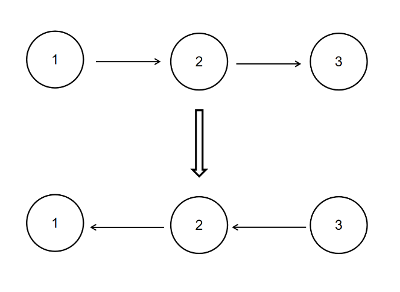
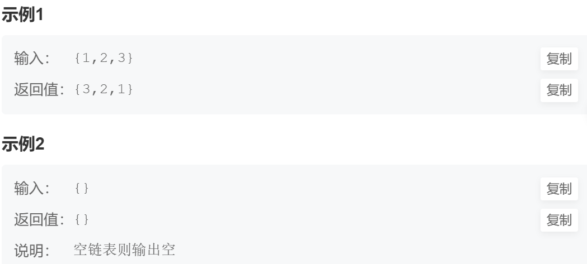

## 描述

给定一个单链表的头结点pHead(该头节点是有值的，比如在下图，它的val是1)，长度为n，反转该链表后，返回新链表的表头。

数据范围： `0≤n≤1000`

要求：空间复杂度 `O(1)` ，时间复杂度`O(n)`

如当输入链表`{1,2,3}`时，

经反转后，原链表变为`{3,2,1}`，所以对应的输出为`{3,2,1}`。

以上转换过程如下图所示：





# 代码

```java
import java.util.*;

/*
 * public class ListNode {
 *   int val;
 *   ListNode next = null;
 *   public ListNode(int val) {
 *     this.val = val;
 *   }
 * }
 */

public class Solution {
    /**
     * 代码中的类名、方法名、参数名已经指定，请勿修改，直接返回方法规定的值即可
     *
     * 
     * @param head ListNode类 
     * @return ListNode类
     */
    public ListNode ReverseList (ListNode head) {
        // write code here
        if(head == null) return null; 
        ListNode pre = null;
        ListNode temp = null;
        while(head != null) {
            temp = head.next;
            head.next = pre;
            pre = head;
            head = temp;
        }
        return pre;
    }
}
```

首先，如果链表为空（即头节点为空），则直接返回`null`。

否则，初始化`pre`为`null`，`temp`为`null`。接下来，使用一个循环，迭代地将每个节点的指针反转。在每次循环中，将`temp`指向当前节点的下一个节点，然后将当前节点的`next`指针指向前一个节点`pre`。然后，更新`pre`为当前节点`head`，继续循环直到头节点为空。最后，返回反转后的链表的头节点`pre`。 